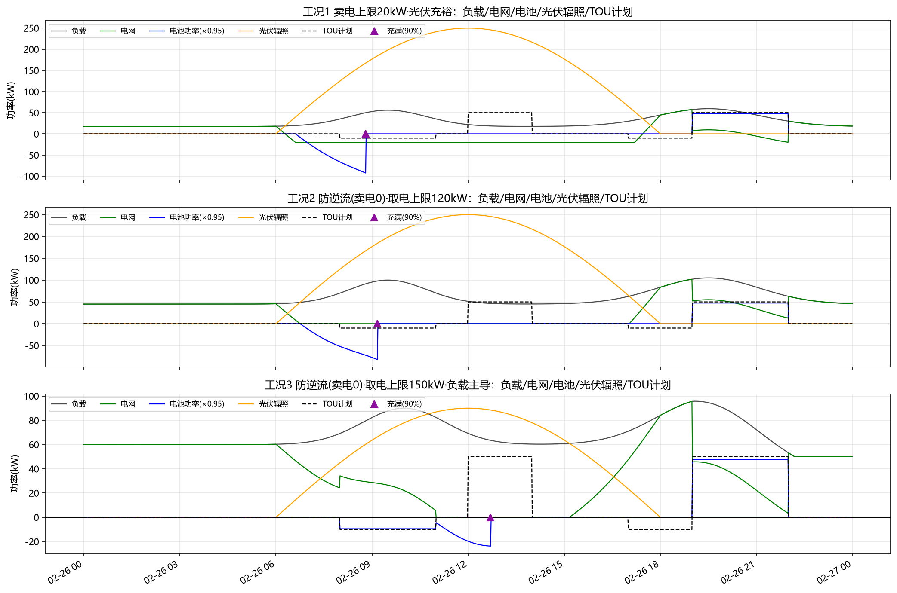
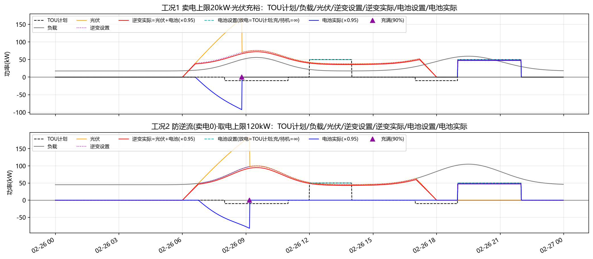

# 光储一体机(混你) EMS/TOU 控制仿真报告

- 生成时间：2026-09-06 23:59:15
- 模型：`mode_hybrid.HybridInverter`；额定 125kW；PV 2 倍超配 250kW；电池 125kW/200kWh；SOC [10%,90%]
- TOU 控制：充电(08-11、17-19) 10kW / 放电(12-14、19-22) 50kW / 其余待机；**负充正放**
- EMS 策略（提示词.md）：馈网上限 F（正=卖电上限，0=防逆流），约束内尽量多卖电且**不突破计划放电**；取电上限 I（0=不取电），**负载用电+充电总取电不超 I**，约束内尽量少取电；光伏消纳优先级高于 TOU 计划（充/放/待机均适用），富余先削减 TOU 放电、再反转为充电（≤1 倍额定）；TOU 充电在取电上限允许下可由电网补足按计划执行，超限则削减充电功率；SOC 到限功率清零；TOU 放电不突破计划

## 工况汇总

| 工况 | 光伏可用(kWh) | 负载(kWh) | 电池充/放(kWh) | 购电(kWh) | 馈网(kWh) | 弃光(kWh) | SOC范围% | 校验 |
|---|---|---|---|---|---|---|---|---|
| 工况1 卖电上限20kW·光伏充裕 | 1910 | 704 | 120.3/150.0 | 227.6 | 231.4 | 1231.8 | 15.0 ~ 90.0 | [OK] |
| 工况2 防逆流(卖电0)·取电上限120kW | 1910 | 1486 | 120.6/150.0 | 645.5 | 0.0 | 1099.3 | 15.0 ~ 90.0 | [OK] |
| 工况3 防逆流(卖电0)·取电上限150kW·负载主导 | 688 | 1633 | 60.1/150.0 | 895.5 | 0.0 | 40.3 | 15.0 ~ 90.0 | [OK] |

## 图一：执行策略——工况1~3（负载/电网/电池(×0.95)/光伏辐照/TOU计划；已去除逆变功率以避免曲线重叠）

> 说明：图一电池功率曲线按计算值×0.95 绘制以分离重叠。

## 图二：TOU 赋值计算公式示意——工况1~2（TOU计划/负载/光伏/逆变设置/逆变实际/电池设置/电池实际，含充满▲/放空▼标识）

> 说明：按提示词.md 第二张图重写。充电/待机：电池设置=∞（曲线 NaN 断线），DSP 允许光伏突破计划充电，充电电网部分受取电上限约束 `逆变设置=MIN(TOU计划, 电池最大取电-负载)`、待机取电网 0；放电：电池设置=TOU计划功率（直接放电）、计划内富余可馈网(≤F)、不突破计划。物理口径恒等：逆变实际=光伏实际+电池实际(放电为正)、逆变设置=EMS 目标(逆变设置列)；实际曲线按×0.95 错开显示。
> 校验：光伏最大功率=250kW；逐分钟满足 `光伏实际+电池实际=逆变实际`（max err≤0.001kW），即“放电为正”口径下 `电池功率 = 逆变口功率 − 光伏功率`。

## 各工况说明

### 工况1：卖电上限20kW·光伏充裕

- 校验项：馈网(卖电)不超过20kW → [OK]
- 数据：`data/case1_inverter.csv`、`data/case1_battery.csv`、`data/case1_grid.csv`、`data/case1_pv.csv`、`data/case1_merged.csv`

### 工况2：防逆流(卖电0)·取电上限120kW

- 校验项：防逆流(无馈网)且取电≤120kW → [OK]
- 数据：`data/case2_inverter.csv`、`data/case2_battery.csv`、`data/case2_grid.csv`、`data/case2_pv.csv`、`data/case2_merged.csv`

### 工况3：防逆流(卖电0)·取电上限150kW·负载主导

- 校验项：取电不超过150kW且无馈网 → [OK]
- 数据：`data/case3_inverter.csv`、`data/case3_battery.csv`、`data/case3_grid.csv`、`data/case3_pv.csv`、`data/case3_merged.csv`

## 说明与假设

- “逆变设置功率”=EMS 模式目标 AC 出力（充电=取电上限约束下的充电功率(负)；待机=TOU计划(0)；放电=光伏馈网+负载的期望出力，均受逆变限幅）。
- “电池设置功率”=放电时段 TOU计划功率；充电/待机=∞（不直接限制电池，仅由取电上限/光伏富余间接控制，图中为断线）。
- “逆变实际功率”=光伏实际 + 电池实际（电池负充正放），受 SOC/功率限值修正。
- 工况1 描述（提示词）：馈网功率很大——卖电上限 20kW；光伏最大功率 250kW；负载=原曲线70%（基准下调20kW后再×0.7）。
- 工况2 描述（提示词）：馈网功率=0（防逆流保护），限制取电功率 120kW；光伏最大功率 250kW。
- 工况3 场景参数：防逆流(卖电上限0kW)；取电上限 150kW；负载较原曲线下调 50%、最低功率钳位 50kW；19:00 起 5 小时内负载逐渐下降 30 kW。
- 工况3 说明：负载峰值约 96kW ≤ 取电上限 150kW，全天无缺供且无馈网（防逆流）；光伏富余只能充电池，充满(SOC90%)后多余弃光；充电(08-11、17-19)与放电(12-14、19-22)按 TOU 执行。
- 图中事件标识：▲=电池充满(SOC 到达上限)、▼=电池放空(SOC 到达下限)，标于 y=0。
