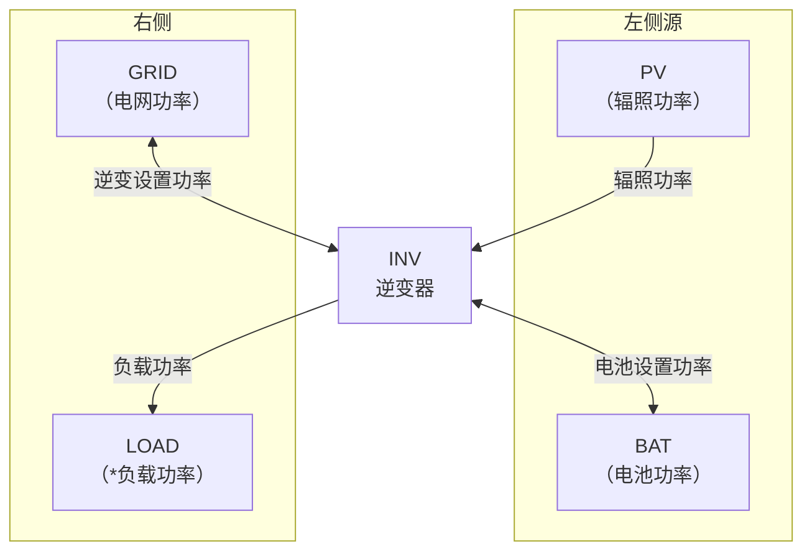

# 参考光储逆变器产品，创建个光储一体机（混逆）模型，用于功率控制和数据仿真

## 硬件拓扑图

## 光储并网系统功率流向框图

- 2个控制接口电池设置功率和逆变设置功率
- 逆变口功率=光伏发电+电池功率
- 电池根据TOU控制逻辑充电/放电
- 电池和光伏采用直流母线并联发电
- 电池口可以根据TOU设置充电/放电功率
- 负载功率可以从逆变口取电，不足时从电网取电

## 功率流向说明

| 路径             | 方向 | 说明                     |
| -------------- | -- | ---------------------- |
| PV → INV       | 单向 | 光伏辐照功率输入逆变器            |
| BAT ↔ INV      | 双向 | 电池充放电，由"电池设置功率"控制      |
| INV → GRID（电网） | 双向 | 逆变设置功率馈入电网,负载或者电网从逆变取电 |
| INV → LOAD（负载） | 单向 | 逆变设置功率供给本地负载           |
## 定义
- TOU是指设定电池端功率的计划，而不是逆变器端功率，这点与PCS不同
- TOU充放电限制： Pchar_grid≤Ptou；Pdisc_bat≤Ptou
- TOU放电目标是尽量满足TOU放电计划
  - 会被负载或者防逆流开关，间接调整逆变口限制影响
  - 会被光伏发电功率影响，受限于逆变额定功率
- TOU充电目标是电池从电网取电功率
  - 会被取电功率影响，间接影响逆变口限制功率
  - 会被光伏发电功率影响，受限于逆变额定功率

## 硬件要求
- 1倍额定功率125kw
- PV支持2倍光伏超配，2倍额定功率
- 储能和逆变器口是1倍额定功率
- 逆变设置功率是限制功率，当光伏和电池不能满足工况时，逆变设置功率=光伏+电池功率
## 控制优先级

- SOC过上下限时触发保护动作时电池功率清零
- 负载取电优先级》光伏 》电池 》电网
- 电池充电优先级》光伏 》电网
- 馈网电能优先级》光伏 》电池
- 光伏发电供给优先级 》负载 》电池 》电网

## EMS混逆执行策略

- 馈网功率是正数代表向电网卖电，例子我们设定70 kW，设置0 kW代表启动防逆流，系统约束的对电网卖电功率，并非目标值
- 取电功率限制，逆变器设置充电功率+负载用电功率不能超过电网最大取电功率，我们设定100 kW，设置0 kW代表不从电网取电。系统约束尽量小从电网取电，并非目标值
- TOU放电时不会突破计划放电功率限制，光伏有发电功率 + 电池功率上升达到1倍额定功率，减小电池发电功率，甚至反转为充电
- TOU充/放/待机光伏消纳优先级大于策略中储能TOU计划的优先级，光伏消耗不掉能量会减少TOU储能计划放电，甚至反转为充电，最大充电功率为1倍额定功率
- TOU充电计划功率和取电功率优先保证取电功率，超过取电功率时，充电计划功率会减少，保证不超取电上限，超限时先降充电计划，取电随之下降。
- TOU充电时，在取电功率允许情况下，可以从电网取电，保证电池设置功率按照计划功率执行
- TOU充电时，光伏充足时，优先减少电网取电，其次储能充电，储能充满余电根据馈网功率设定决定是否馈电网
- 负载>取电功率时，TOU不会突破TOU设置计划放电功率
- TOU充电时，设置逆变口限制功率是充电，逆变器不能翻转为放电，若光伏辐照强，只能用光伏对电池充电，逆变口无法转为放电，需要翻转逆变口充电功率为放电（**注意：不能自动调整逆变口充电方向为放电方向，无法按照计划充电执行**）

## 绘制曲线图要求

调用混逆模型仿真实现TOU控制逻辑（充50/放50/待机；负充正放），需要考虑到上文中的EMS策略可能性
测试以下工况，并且用matplotlib.pyplot 记录测试结果，并且产生测试文档。

### 第一张图绘制内容

描述执行策略时全部工况，负载功率/电网功率/电池功率/光伏辐照功率/TOU计划功率/逆变功率

### 第二张图绘制内容，EMS怎么控制电池

- TOU赋值计算公式，绘制数据：TOU计划功率/逆变设置功率/逆变实际功率/电池设置功率/电池实际功率/充满防空标识
  - 充电（电池最大从电网取电这么多，DSP允许突破计划用光伏充电，间接控制电池功率目的）
    逆变设置功率（限制功率）=MIN(TOU计划功率, 最大取电功率 - 负载功率)
    电池设置功率=自动
  - 待机（电池最大从电网取电0，DSP允许突破计划用光伏充电，间接控制电池功率目的）
    逆变设置功率（限制功率）=TOU计划功率
    电池设置功率=自动
  - 放电（直接设置电池放电功率）
    逆变设置功率（限制功率）=馈电功率+负载功率
    电池设置功率=TOU计划功率
- 工况1描述：馈网功率很大
- 工况2描述：馈网功率=0（防逆流保护），限制取电功率120 kW

## 方案约束
- 三相不平衡只能在，自发自用下实现，TOU计划逆变口为限制功率，无法做分相控制
- 无法通过逆变口设置功率实现控制电池口的效果，光伏功率受到逆变口约束，逆变口功率再依据光伏功率和电池功率计算，会导致光伏功率收敛到0
- TOU控制电池口多机并机，由于某台机器功率不足时，其他机器需要补充功率