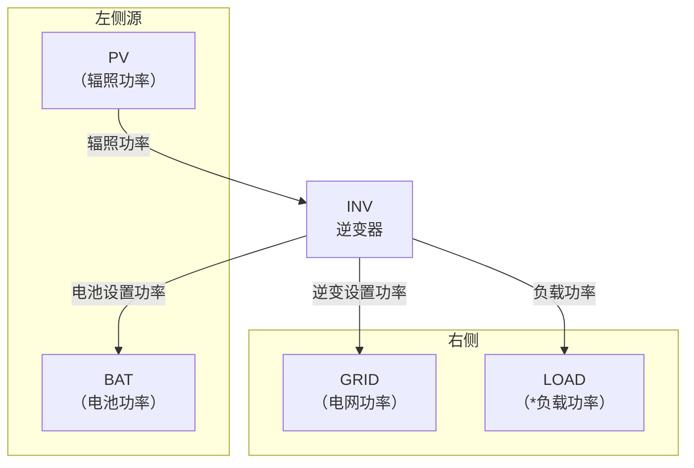

# 参考光储逆变器产品，创建个光储一体机（混你）模型，用于功率控制和数据仿真
## 硬件拓扑图

# 光储并网系统功率流向框图

# 光储并网系统功率流向框图

- 2个控制接口电池设置功率和逆变设置功率
- 逆变口功率=光伏发电+电池功率
- 电池根据TOU控制逻辑充电/放电
- 电池和光伏采用直流母线并联发电
- 电池口可以根据TOU设置充电/放电功率
- 负载功率可以从逆变口取电，不足时从电网取电
- 光伏发电可以为负载供电，多余功率可以馈入电网，超过馈电功率时为电池充电
## 功率流向说明

| 路径 | 方向 | 说明 |
|---|---|---|
| PV → INV | 单向 | 光伏辐照功率输入逆变器 |
| BAT ↔ INV | 双向 | 电池充放电，由"电池设置功率"控制 |
| INV → GRID（电网） | 双向 | 逆变设置功率馈入电网,负载或者电网从逆变取电 |
| INV → LOAD（负载） | 单向 | 逆变设置功率供给本地负载 |

## 硬件要求
- 1倍额定功率125kw
- PV支持2倍光伏超配，2倍额定功率
- 储能和逆变器口是1倍额定功率
- 逆变设置功率是限制功率，当光伏和电池不能满足工况时，逆变设置功率=光伏+电池功率
## 控制优先级
- SOC过上下限时触发保护动作时电池功率清零
- 负载取电优先级》光伏 》电池 》电网
- 电池充电优先级》光伏 》电网
- 馈网电能优先级》光伏 》电池
- 光伏发电供给优先级》负载 》 电网 》电池
## EMS混逆执行策略
- 馈网功率是正数代表向电网卖电，例子我们设定70KW，设置0KW代表启动防逆流，系统约束尽量大的对电网卖电（不突破计划放电功率）
- 取电功率限制，逆变器设置充电功率+负载用电功率不能超过电网最大取电功率，我们设定100KW，设置0KW代表不从电网取电。系统约束尽量小从电网取电
- TOU放电时且电网功率没有达到馈网功率时，储能不会增加放电功率限制来满足馈网功率
- TOU充/放/待机光伏消纳优先级大于策略中储能TOU计划的优先级，光伏消耗不掉能量会减少TOU储能计划放电，甚至反转为充电，最大充电功率为1倍额定功率
- TOU充电计划功率和取电功率优先保证取电功率，超过取电功率时，充电计划功率会减少，取电功率会减少
- TOU充电时，在取电功率允许情况下，可以从电网取电，保证电池设置功率按照计划功率执行
- 负载>取电功率时，TOU不会突破TOU设置计划放电功率
## 绘制曲线图要求
调用混你模型仿真实现TOU控制逻辑（充50/放50/待机；负充正放），需要考虑到上文中的EMS策略可能性
测试以下工况，并且用matplotlib.pyplot 记录测试结果，并且产生测试文档。
### 第一张图绘制内容
描述执行策略时全部工况，负载功率/电网功率/电池功率/光伏辐照功率/TOU计划功率/逆变功率
### 第二张图绘制内容
- TOU赋值计算公式，绘制数据：TOU计划功率/逆变设置功率/逆变实际功率/电池设置功率/电池实际功率/充满防空标识
    - 充电（电池最大从电网取电这么多，DSP允许突破计划用光伏充电，间接控制电池功率目的）
    逆变设置功率=MIN(TOU计划功率, 电池最大取电功率 - 负载功率)
    电池设置功率=无穷大
    - 待机（电池最大从电网取电0，DSP允许突破计划用光伏充电，间接控制电池功率目的）
    逆变设置功率=TOU计划功率
    电池设置功率=无穷大
    - 放电（直接设置电池放电功率）
    逆变设置功率=馈电功率+负载功率
    电池设置功率=TOU计划功率
- 工况1描述：馈网功率很大
- 工况2描述：馈网功率=0（防逆流保护），限制取电功率120KW
